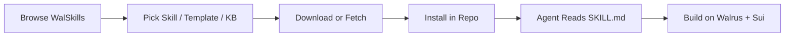

# WalSkills — Walrus Skills Marketplace


WalSkills is a developer marketplace and agent hub for the **Walrus + Sui** ecosystem. It packages repeatable workflows as installable **skills**, production **templates**, and fetchable **knowledge guides** so teams can onboard faster and ship with AI-assisted development.

---

## Table of Contents

- [What Is WalSkills?](#what-is-walskills)
- [System Architecture](#system-architecture)
- [Skills Architecture](#skills-architecture)
- [How to Use Skills](#how-to-use-skills)
- [What You Can Build](#what-you-can-build)
- [Content Types](#content-types)
- [Agent Integration](#agent-integration)
- [Curated Collections](#curated-collections)
- [Platform Architecture](#platform-architecture)
- [Local Development](#local-development)
- [Contributing Content](#contributing-content)
- [Vision](#vision)

---

## What Is WalSkills?

WalSkills is:

- A **file-based developer marketplace** for Walrus builders
- An **onboarding layer** for teams and solo developers
- A **reusable library** of skills, templates, and operational knowledge
- An **agent-ready hub** compatible with Cursor, Claude, ChatGPT, GitHub Copilot, and similar tools

Instead of rebuilding the same Walrus setup, site deployment, storage flows, and integration patterns from scratch, builders install proven resources into their repo and let their agent execute them.

---

## System Architecture

WalSkills is organized in four layers:

```txt
┌─────────────────────────────────────────────────────────────┐
│                     WalSkills Web App                       │
│  Landing · Get Started · Browse · Templates · Knowledge     │
└───────────────────────────┬─────────────────────────────────┘
                            │
┌───────────────────────────▼─────────────────────────────────┐
│                    API + Loaders (src/lib)                  │
│  skills.ts · templates.ts · knowledge-bases.ts · search    │
└───────────────────────────┬─────────────────────────────────┘
                            │
┌───────────────────────────▼─────────────────────────────────┐
│              Filesystem Content (src/data)                  │
│  skills/ · templates/ · knowledge-bases/ · collections    │
└───────────────────────────┬─────────────────────────────────┘
                            │
┌───────────────────────────▼─────────────────────────────────┐
│                  Developer's Project / Agent                │
│  .claude/skills/ · agent context · fetched KB markdown      │
└─────────────────────────────────────────────────────────────┘
```

### End-to-end flow



1. **Discover** — browse skills, templates, or knowledge on the marketplace
2. **Select** — pick a single resource or a curated collection
3. **Install** — download a skill folder or fetch KB markdown
4. **Execute** — your AI agent reads `SKILL.md` and follows the workflow
5. **Ship** — deploy sites, integrate storage, build apps on Walrus + Sui

---

## Skills Architecture

A **skill** is the core unit of WalSkills. It is a folder your agent can load to perform a specific Walrus-related task.

### Skill folder structure

```txt
src/data/skills/<slug>/
├── SKILL.md        # Required — agent instructions + metadata
└── README.md       # Optional — human-readable overview
```

After installation in your project:

```txt
your-project/
└── .claude/skills/           # or your agent's skills directory
    └── deploy-walrus-site/
        ├── SKILL.md
        └── README.md
```

### SKILL.md format

Every skill uses YAML frontmatter followed by markdown instructions:

```yaml
---
name: Walrus Site Configuration
description: Configure Walrus Sites using ws-resources.json...
category: Infrastructure
difficulty: intermediate
author: WalSkills
version: "1.0.0"
skills:
  - Walrus
  - Walrus Sites
  - Site Builder
  - Sui
---
```

| Field | Purpose |
|---|---|
| `name` | Display name in the marketplace |
| `description` | Used by agents to decide when to load the skill |
| `category` | Browse filter (Infrastructure, Full Stack, etc.) |
| `difficulty` | `beginner` · `intermediate` · `advanced` |
| `author` | Contributor or team name |
| `version` | Semantic version string |
| `skills` | Tags for search and filtering |

The markdown body contains step-by-step instructions, commands, validation checklists, and references your agent follows at runtime.

### How skills are loaded (platform side)

```txt
src/data/skills/<slug>/SKILL.md
        │
        ▼
src/lib/skills.ts          → parseFrontmatter()
        │
        ▼
src/app/api/skills/route.ts → JSON API
        │
        ▼
Browse UI / Detail Page / Download ZIP
```

Skills are read from disk at build/request time — no database required for content.

---

## How to Use Skills

### Option 1 — Quick start (recommended for new users)

1. Open **[Get Started](/get-started)** in the app
2. Pick a builder path:
   - **Walrus Sites** — deploy and host decentralized sites
   - **Local Portal** — preview Testnet sites locally
   - **Ship an App** — full-stack UI with Walrus storage
   - **Walrus Foundations** — architecture, config, and linking
3. Install the recommended skill bundle into your agent skills folder
4. Ask your agent to execute the workflow (e.g. *"Deploy my site using the deploy-walrus-site skill"*)

### Option 2 — Browse and install manually

1. Go to **[Skills](/browse)**
2. Search, filter by category, or open a **curated collection**
3. Open a skill detail page
4. Review `SKILL.md` and optional `README.md`
5. Click **Download** to get `<slug>.zip`
6. Extract into your agent skills directory:

```bash
unzip deploy-walrus-site.zip -d .claude/skills/
```

### Option 3 — Use with Knowledge Base

Skills tell your agent **what to do**. Knowledge Base articles provide **deeper reference material**.

```bash
# Fetch a guide as markdown for your agent
curl -o walrus-guide.md https://<your-domain>/knowledge/setup-walrus-client/raw
```

Share the raw URL or saved markdown with your agent alongside installed skills.

### Option 4 — Start from a template

Templates are starter implementation patterns (Move, JavaScript, Python, TypeScript SDK). Install them the same way as skills, then ask your agent to adapt the template to your product.

---

## What You Can Build

WalSkills resources map to concrete builder outcomes on Walrus + Sui:

### Decentralized websites (Walrus Sites)

| Resource | What it enables |
|---|---|
| `deploy-walrus-site` | Publish static sites via `site-builder` |
| `walrus-site-configuration` | SPA routing, headers, metadata via `ws-resources.json` |
| `linking-walrus-sites-external-urls` | Cross-site and external URL navigation |
| `deploy-local-portal` | Browse Testnet sites on your machine |
| `techincal-architecture-overview` | Understand quilts, portals, Sui indexing, domain isolation |

**Build:** landing pages, docs sites, dApp frontends, AI-readable portals, community hubs

---

### Full-stack applications

| Resource | What it enables |
|---|---|
| `fullstack-web3-dev` | End-to-end app architecture on Walrus + Sui |
| `ui-ux-designer` | Product UI/UX patterns for Web3 apps |
| `walrus-with-javascript` | JS/TS integration template |
| `walrus-with-python` | Python integration template |
| `walrus-with-move` | Move smart contract template |
| `walrus-relay-sdk-typescript` | TypeScript relay SDK starter |

**Build:** storage-backed dApps, dashboards, upload portals, NFT/metadata apps, AI + on-chain products

---

### Walrus storage & infrastructure

| Knowledge Base | What it covers |
|---|---|
| `setup-walrus-client` | Client setup and configuration |
| `storing-blobs-walrus` | Write and store blob data |
| `reading-blobs-walrus` | Read and retrieve blobs |
| `managing-blobs-walrus` | Lifecycle and blob management |
| `walrus-quilts` | Quilt-based storage for sites and bundles |
| `walrus-fundamental` | Core Walrus concepts |
| `walrus-operations` | Operational workflows |
| `set-up-storage-node-walrus` | Run a storage node |
| `migrate-storage-node` | Node migration |
| `sui-archival-system` | Sui archival integration |
| `why-walrus` | Architecture rationale |
| `vercel-deployment-web3` | Deploy Web3 apps on Vercel |

**Build:** blob storage pipelines, archival systems, storage nodes, production infra

---

### Example builder journeys

```txt
Journey A — First Walrus Site
  Get Started → Walrus Sites
  → deploy-walrus-site
  → walrus-site-configuration
  → linking-walrus-sites-external-urls

Journey B — Ship a Product
  Get Started → Ship an App
  → fullstack-web3-dev
  → ui-ux-designer
  → walrus-with-javascript (template)

Journey C — Learn Foundations
  Get Started → Walrus Foundations
  → techincal-architecture-overview
  → setup-walrus-client (KB)
  → walrus-quilts (KB)
```

---

## Content Types

| Type | Location | Primary file | Consumed by |
|---|---|---|---|
| **Skill** | `src/data/skills/<slug>/` | `SKILL.md` | Agent + developer |
| **Template** | `src/data/templates/<slug>/` | `SKILL.md` / `Skill.md` | Agent + developer |
| **Knowledge Base** | `src/data/knowledge-bases/<slug>/` | `KB.md` | Agent (via raw URL) + developer |
| **Collection** | `src/data/collections.json` | JSON bundle | Developer onboarding |

### Skills vs templates vs knowledge

- **Skills** — focused task workflows (deploy, configure, link, design)
- **Templates** — broader starter projects you extend into full apps
- **Knowledge** — deep reference docs fetched on demand
- **Collections** — pre-grouped skill paths for common goals

---

## Agent Integration

WalSkills is designed for AI-assisted development. Supported tool categories include:

- ChatGPT
- Claude / Claude Code
- Cursor IDE
- Gemini
- GitHub Copilot
- OpenRouter

### Recommended agent workflow

1. Install relevant skills into `.claude/skills/` (or equivalent)
2. Fetch KB articles when deep context is needed
3. Prompt your agent with a clear goal:

```txt
Using the deploy-walrus-site and walrus-site-configuration skills,
deploy my Vite app to Walrus Testnet and configure SPA routing.
```

4. Agent reads `SKILL.md` frontmatter to confirm relevance
5. Agent executes steps, commands, and validation checklists from the skill body

### Agent fetch URL (Knowledge Base)

Each KB article is available as raw markdown:

```txt
GET /knowledge/<slug>/raw
Content-Type: text/markdown
```

Use this in agent prompts, CI pipelines, or documentation sync workflows.

---

## Curated Collections

Collections bundle skills for common builder paths (`src/data/collections.json`):

| Collection | Purpose | Skills included |
|---|---|---|
| **Walrus Starter Pack** | First site + local preview | deploy-walrus-site, deploy-local-portal, walrus-site-configuration |
| **Walrus Sites** | Deploy, configure, link sites | deploy-walrus-site, walrus-site-configuration, linking-walrus-sites-external-urls |
| **Ship on Walrus + Sui** | Full-stack product building | fullstack-web3-dev, ui-ux-designer, deploy-walrus-site |
| **Walrus Foundations** | Architecture and config depth | techincal-architecture-overview, walrus-site-configuration, linking-walrus-sites-external-urls |

---

## Platform Architecture

### Tech stack

- **Next.js 16** (App Router)
- **React 19**
- **Tailwind CSS v4**
- **shadcn/ui**
- **react-markdown** + **remark-gfm**

### Project structure

```txt
src/
├── app/                    # Pages and API routes
│   ├── page.tsx            # Landing
│   ├── get-started/        # Onboarding paths
│   ├── browse/             # Skills marketplace
│   ├── templates/          # Template catalog
│   ├── knowledge/          # Knowledge Base
│   ├── tutorial/           # Marketplace guide
│   └── api/                # skills, templates, KB, collections, downloads
├── components/             # UI components
├── lib/                    # Loaders, parsers, search, download utilities
└── data/                   # Marketplace source content (filesystem)
    ├── skills/
    ├── templates/
    ├── knowledge-bases/
    └── collections.json
```

### Key loaders

| Module | Responsibility |
|---|---|
| `src/lib/skills.ts` | Load and parse skill folders |
| `src/lib/templates.ts` | Load and parse template folders |
| `src/lib/knowledge-bases.ts` | Load and parse KB articles |
| `src/lib/collections.ts` | Resolve collection → skill bundles |
| `src/lib/parse-frontmatter.ts` | YAML frontmatter parser |
| `src/lib/search.ts` | Fuzzy search for browse |
| `src/lib/download.ts` | Client-side ZIP generation |

### API routes

| Route | Returns |
|---|---|
| `GET /api/skills` | All skill profiles |
| `GET /api/templates` | All template profiles |
| `GET /api/knowledge-bases` | All KB entries |
| `GET /api/collections` | Collections with resolved skills |
| `POST /api/downloads` | Download tracking |
| `GET /knowledge/[slug]/raw` | Raw KB markdown for agents |

---

## Local Development

```bash
pnpm install
pnpm run dev
```

Open `http://localhost:3000` (or the next available port).

### Scripts

| Command | Description |
|---|---|
| `pnpm run dev` | Start development server |
| `pnpm run build` | Production build |
| `pnpm run start` | Run production server |
| `pnpm run lint` | Run ESLint |

---

## Contributing Content

All marketplace content is filesystem-based. Add a folder under `src/data/` and it appears in the UI after restart.

### Add a skill

1. Create `src/data/skills/<slug>/`
2. Add `SKILL.md` with frontmatter + instructions
3. Optionally add `README.md` for humans
4. Run `pnpm run dev` and verify at `/browse/<slug>`

**Frontmatter checklist:**

- Clear `description` so agents load the right skill
- Accurate `category` and `difficulty`
- Useful `skills` tags for search
- Short, actionable markdown body with commands and validation steps

### Add a template

1. Create `src/data/templates/<slug>/`
2. Add `SKILL.md` (or `Skill.md`) with frontmatter + starter instructions

### Add a knowledge base

1. Create `src/data/knowledge-bases/<slug>/`
2. Add `KB.md` with frontmatter + guide content
3. Verify raw route at `/knowledge/<slug>/raw`

### Add a collection

Edit `src/data/collections.json` and reference existing skill slugs.

---

## Vision

WalSkills aims to be the default developer entry point for Walrus:

- from **first setup**
- to **first deployment**
- to **production-grade delivery patterns**

If it helps builders ship faster on Walrus + Sui, it belongs in WalSkills.

---

## Quick Links

| Page | URL |
|---|---|
| Home | `/` |
| Get Started | `/get-started` |
| Skills | `/browse` |
| Templates | `/templates` |
| Knowledge | `/knowledge` |
| Guide | `/tutorial` |
